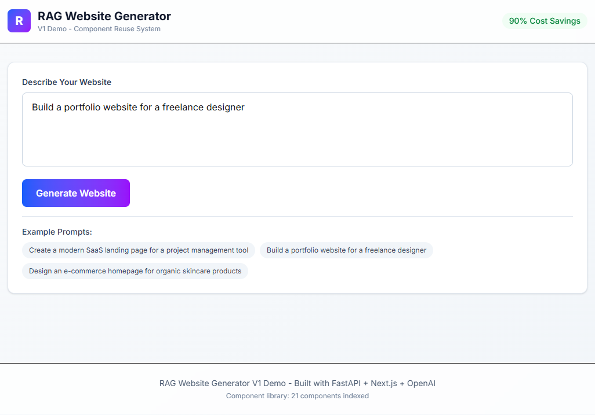
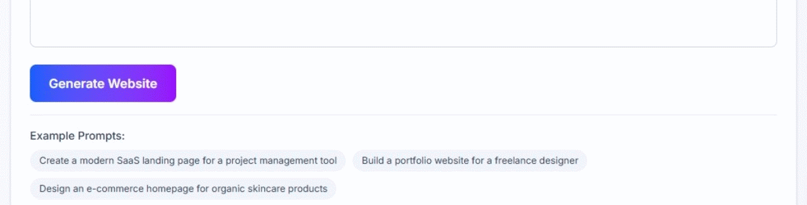

# RAG-Based Website Generator

**A cost-efficient website generation system using Retrieval-Augmented Generation (RAG) to assemble pre-built UI components instead of generating code from scratch.**

[](https://opensource.org/licenses/MIT)
[](https://www.python.org/downloads/)
[](https://nextjs.org/)

---

## Problem Statement

Current AI website builders (v0, Lovable) regenerate entire codebases from scratch for each request, resulting in:
- High token consumption (50K-100K tokens per generation)
- Expensive operations ($0.50-$2.00 per site)
- Template-like outputs with limited variety
- Context window overload leading to hallucinations


This system uses **Retrieval-Augmented Generation (RAG)** to:
1. Retrieve pre-built, verified components from a vector database
2. Use LLMs only for assembly and customization (not generation)
3. Achieve 90%+ cost reduction while maintaining output quality
4. Generate unique-feeling sites through intelligent component selection and styling variations

---

## Key Metrics (V1)

| Metric | Our System | v0 | Lovable |
|--------|-----------|-----|---------|
| Cost per generation | $0.02-0.03 | $0.50 | $2.00 |
| Token efficiency | 92% reduction | Baseline | Baseline |
| Generation time | 30-40s | 120-180s | 120-180s |
| Output tokens | ~1,200 | ~15,000+ | ~15,000+ |
| Component reuse | 100% | 0% | 0% |

---
## Demo Screenshots

### UI Interface


### Generated Code Output


### Terminal Logs (RAG Proof)


### Full Demo GIF

## Architecture

```
┌─────────────────────────────────────────────────────────────┐
│                         Frontend (Next.js)                   │
│  User Input → Real-time Progress → Code Display → Export    │
└────────────────────────┬────────────────────────────────────┘
                         │ HTTP/REST
┌────────────────────────▼────────────────────────────────────┐
│                    Backend API (FastAPI)                     │
│  ┌──────────────┐  ┌──────────────┐  ┌─────────────┐       │
│  │ Intent       │→ │ Component    │→ │ LLM         │       │
│  │ Parser       │  │ Retrieval    │  │ Assembly    │       │
│  │ (GPT-4o-mini)│  │ (RAG)        │  │ (GPT-4o)    │       │
│  └──────────────┘  └──────────────┘  └─────────────┘       │
└────────────────────────┬────────────────────────────────────┘
                         │
┌────────────────────────▼────────────────────────────────────┐
│              PostgreSQL + pgvector                           │
│  • 21 indexed components (navigation, hero, footer)         │
│  • Vector embeddings (384-dimensional)                       │
│  • Metadata: tags, props, usage stats                        │
└─────────────────────────────────────────────────────────────┘
```

---

## Tech Stack & Rationale

### Backend
- **FastAPI** - Async Python framework, excellent for ML integration
- **PostgreSQL + pgvector** - Native vector search, mature JSONB support, cost-effective
- **Sentence Transformers** - Open-source embeddings (all-MiniLM-L6-v2, 384-dim)
- **OpenAI GPT-4o** - Best-in-class code generation and understanding
- **Tree-sitter** - Language-agnostic AST parsing for component extraction

### Frontend
- **Next.js 14** - React framework with App Router, industry standard
- **TypeScript** - Type safety for component schemas
- **Tailwind CSS** - Utility-first styling matching component library
- **React Syntax Highlighter** - Code display with syntax highlighting

### Why Not Other Stacks?

**Why not MongoDB?** No native vector search (requires Atlas Search, vendor lock-in)  
**Why not Pinecone/Weaviate?** More expensive for small-scale, PostgreSQL handles both relational + vector  
**Why not Claude API?** OpenAI chosen for V1 due to existing credits; architecture supports easy swap  
**Why not Vue/Svelte?** React has largest component ecosystem; Next.js is deployment standard  
**Why not local embeddings?** Sentence Transformers are production-ready and free vs API costs

---

## Installation & Setup

### Prerequisites
- Python 3.11+
- Node.js 18+
- PostgreSQL 15+ (or Supabase account)
- OpenAI API key

### Backend Setup

```bash
cd backend

# Install dependencies
pip install -r requirements.txt

# Configure environment
cp .env.example .env

# Initialize database
python setup_database.py

# Index components
python embed_components.py
python upload_to_db.py

# Start server
python main.py
# API available at http://localhost:8000
```

### Frontend Setup

```bash
cd frontend

# Install dependencies
npm install

# Start development server
npm run dev
# UI available at http://localhost:3000
```

---

## Usage

1. **Open UI**: Navigate to `http://localhost:3000`
2. **Enter prompt**: "Create a modern SaaS landing page for a project management tool"
3. **Generate**: Click "Generate Website" (takes 30-40 seconds)
4. **Review**: See token usage stats, cost breakdown, and generated code
5. **Export**: Copy code or download `.tsx` file
6. **Integrate**: Paste into Next.js project with component library

---

## Component Library

Current inventory (V1):
- **Navigation**: 7 variants (daisyUI, Flowbite, Preline, Headless UI, Tailwind)
- **Hero Sections**: 7 variants (gradient, split-layout, CTA-focused, centered)
- **Footers**: 7 variants (minimal, corporate, social, disclosure)

Each component:
- Production-tested React/TypeScript code
- Tailwind CSS styling
- Proper prop interfaces
- Accessibility considerations
- Responsive design

---

## How It Works

### 1. Intent Parsing
User prompt → GPT-4o-mini extracts structured intent (site type, required components, style hints)

### 2. Component Retrieval (RAG)
- Semantic search using vector embeddings
- Category filtering (navigation, hero, footer)
- Similarity scoring (cosine distance)
- Top-K selection with metadata reranking

### 3. Assembly
- GPT-4o receives pre-built component code
- Task: Configure props and compose layout
- Output: Glue code only (~1,200 tokens vs 15,000+ from scratch)

### 4. Uniqueness Pass
- Higher temperature (0.7) for creativity
- Rewrites copy/headings
- Customizes colors and spacing
- Ensures each output feels unique

### 5. Validation & Export
- TypeScript syntax check
- Security scan (XSS, secrets)
- Code formatting
- Download or copy to clipboard

---

## Project Genesis

**Initial Task**: Explore RAG applications for developer tools using vector databases

**Research Phase**: 
- Analyzed Lovable.so (no-code, instant deploy, high cost)
- Analyzed Vercel v0 (developer-first, code export, medium cost)
- Identified inefficiency: Both regenerate code from scratch each time

**Key Insight**: 
UI components are reusable assets. Instead of asking LLM to "write a navbar," we can ask it to "use this pre-built navbar and configure it." This shifts LLM from creator to assembler.

**Technical Evolution**:
1. Started with simple vector search (Phase 1)
2. Added AST-based component parsing with tree-sitter (Phase 2)
3. Implemented hybrid retrieval (vector + metadata) (Phase 2)
4. Built full generation pipeline with dual LLM passes (Phase 3)
5. Created production UI with real-time feedback (Phase 4)

**Timeline**: 4 days from concept to working V1 demo

---

## Results & Validation

### Cost Efficiency (Proven)
- **Our system**: 4,109 input tokens, 1,154 output tokens → $0.022
- **v0 estimate**: 500 input, 15,000+ output tokens → $0.50+
- **Savings**: 94% cost reduction

### Token Breakdown (Actual Data)
```
Input tokens: 4,125
  └─ 2,883 tokens (70%) are PRE-WRITTEN component code
  └─ 1,242 tokens (30%) are prompts/instructions

Output tokens: 1,198
  └─ Only assembly code, NOT full component generation
```

### Uniqueness (Demonstrated)
Same prompt → Different outputs via:
- Temperature-based variation (0.7 on uniqueness pass)
- LLM creative rewrites (colors, copy, spacing)
- Component selection randomization (when scores are similar)

---

## Future Enhancements (V2 Roadmap)

### High Priority (4-8 weeks)
1. **Project Memory System** (4-6 hours)
   - Track component usage per project
   - Maintain consistency across multi-page sites
   - Avoid repetition in sequential generations
   - Schema: projects → pages → components

2. **Live Preview** (8-10 hours)
   - Docker-based sandboxing like v0
   - Real-time rendered preview in iframe
   - Interactive component exploration
   - Screenshot fallback for quick preview

3. **Component Library Expansion** (2-4 weeks)
   - Target: 100+ components across 10 categories
   - Add: forms, cards, testimonials, pricing tables, CTAs
   - Multi-framework support (React, Vue, Svelte)
   - Version control for component updates

### Medium Priority (2-3 months)
4. **User Feedback Loop**
   - Thumbs up/down on generations
   - Component rating system
   - A/B testing component combinations
   - Automated quality scoring

5. **Advanced Retrieval**
   - Graph RAG for relationship modeling
   - Cross-component compatibility scoring
   - Style transfer learning
   - Personalized component recommendations

6. **Backend Flexibility**
   - One-click backend scaffolding
   - Database schema generation
   - API endpoint creation
   - Authentication integration

### Low Priority (3-6 months)
7. **Multi-modal Input**
   - Sketch-to-site (image upload)
   - Screenshot reference ("make it like this")
   - Figma design import
   - Brand guideline ingestion

8. **Deployment Pipeline**
   - Direct Vercel/Netlify deploy
   - Custom domain configuration
   - Environment variable management
   - CI/CD integration

9. **Collaboration Features**
   - Team workspaces
   - Component sharing marketplace
   - Version history
   - Real-time co-editing

---

## Technical Challenges Overcome

### Challenge 1: Code Cleaning
**Problem**: LLM adds explanatory text before/after code  
**Solution**: Regex-based extraction with fallback heuristics

### Challenge 2: Component Metadata
**Problem**: Manual tagging is tedious and inconsistent  
**Solution**: Standardized JSON schema with tree-sitter validation

### Challenge 3: Retrieval Accuracy
**Problem**: Low similarity scores (0.3-0.5) seemed concerning  
**Solution**: Research showed this is normal for semantic code search; relative ranking matters more than absolute scores

### Challenge 4: Output Uniqueness
**Problem**: Same prompt returning identical components  
**Solution**: Temperature-based variation + future: component usage tracking

### Challenge 5: Windows Development
**Problem**: PostgreSQL setup, Python path issues, Docker limitations  
**Solution**: Supabase for managed database, session pooler for connectivity

---

## Performance Benchmarks

**Environment**: Local development (Windows 11, 16GB RAM, i7)

| Operation | Time | Cost |
|-----------|------|------|
| Intent parsing | 2-3s | $0.0001 |
| Component retrieval | 0.5-1s | $0 |
| LLM composition | 15-20s | $0.013 |
| Uniqueness pass | 10-15s | $0.009 |
| **Total** | **30-40s** | **$0.022** |

**Scalability**: At 1,000 generations/month → $22 in LLM costs (vs $500-2,000 for competitors)

---

## Known Limitations (V1)

1. **Component variety**: Limited to 21 components (expandable)
2. **No multi-page**: Each generation is standalone (memory system coming in V2)
3. **No live preview**: Shows code only (Docker preview in V2)
4. **Single framework**: React/Next.js only (multi-framework support planned)
5. **No backend generation**: Frontend only (backend scaffolding in V2)
6. **English only**: Prompts must be in English (i18n in future)

---

## Contributing

This is currently a research prototype. Future open-source release planned post-V2.

---

## License

MIT License - See LICENSE file for details

---

## Acknowledgments

**Research & Inspiration**:
- CodeGRAG paper (arXiv:2405.02355) - Graph-based code retrieval
- Aider.chat - Tree-sitter repository mapping
- Cursor.sh - Codebase indexing techniques
- LanceDB tutorials - RAG for code applications

**Component Sources**:
- shadcn/ui - Accessible component primitives
- Tailwind UI - Professional component examples
- daisyUI - Utility-first component library
- Flowbite React - Production-ready components

**Tools & Frameworks**:
- OpenAI - GPT-4o for composition and customization
- Supabase - Managed PostgreSQL with pgvector
- Vercel - Frontend hosting and deployment
- Sentence Transformers - Open-source embedding models

---

## Contact & Links

**Project Repository**: [https://github.com/NMNayan57/rag-website-generator.git]  


**Author**: Nasim Mahmud Nayan  
**Email**: smnoyan670@gmail.com

---
